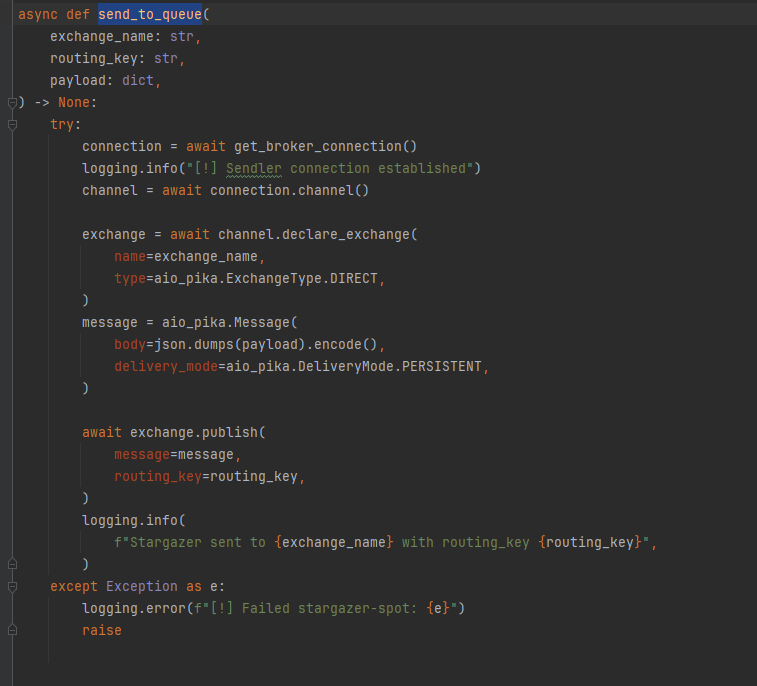

# bsw-test-line-provider
## Тестовое задание
___
## Принцип работы 
### Сервисное взаимодействие  line_provider и bet_maker происходит посредством RabbitMQ, когда дергается ручка
### на получение эвентов, bet_maker отправляет событие в очередь с помощью метода `send_to_queue`, line_provider отвечает ему(высылает валидные эвенты)

___

## Запуск
### Запуск сервиса с помощью `make run-staging`
### Запуск с помощью `docker-compose -f docker-compose-staging.yaml --env-file .env.staging up -d --build --force-recreate`
### API сервиса будет доступен по адресу http://localhost/docs

___

## API bet_maker

`GET /api/v1/events`

*Получить все доступные эвенты*

> Пример ответа

> 200 Статус

```json
[
  {
    "event_id": "123",
    "coefficient": 0.00,
    "deadline": 123456,
    "status": "NEW"
  }
]
```
___
`GET /api/v1/bets`

*Получить историю ставок*

> Пример ответа

> 200 Статус

```json
[
  {
    "event_id": "123",
    "status": "NEW"
  }
]
```
___

`POST /api/v1/bet`

*Сделать ставку на событие*

> Пример запроса

```json
{
  "event_id": "123",
  "sum_bet": 100.12
}
```

> Пример ответа

> 201 Статус

```json
{
  "event_id": "123"
}
```

___

## API line_provider

`POST /api/v1/provider/event`

*Создать событие*

> Пример запроса

```json
{
  "coefficient": 12.12,
  "deadline": 12345,
  "status": "NEW"
}
```

> Пример ответа

> 201 Статус

```json
{
  "event_id": "123"
}
```

___

`PUT /api/v1/provider/event/status`

*Обновить статус события*

> Пример запроса

```json
{
  "event_id": 12.12,
  "status": "FINISHED_LOSE"
}
```

> Пример ответа

> 200 Статус

```json
{
  "message": "event updated!"
}
```

___
